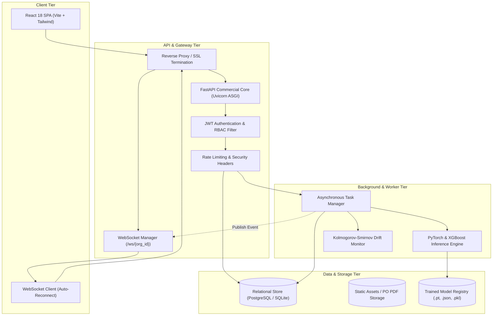
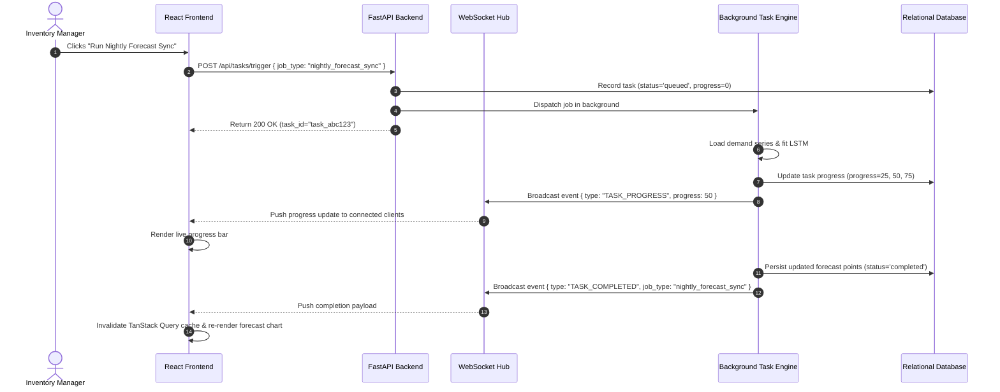

# RetailPulse Enterprise: System Architecture & Data Flow

## 1. High-Level Architectural Overview

RetailPulse employs a modern, multi-tier decoupled architecture engineered for high concurrency, low-latency analytics queries, and real-time state synchronization across retail teams.

---

## 2. Architectural Layers

### 2.1 Frontend Presentation Layer (React 18 + Vite)
- **Framework**: React 18, TypeScript 5.6, Tailwind CSS 3.4.
- **State & Server Cache**: TanStack React Query (`@tanstack/react-query`) with automatic background refetching and cache invalidation upon WebSocket push notifications.
- **Charts & Visualization**: Recharts for responsive time-series charts, radar distribution plots, and cohort bar charts.
- **PDF & Document Engine**: Client-side `jspdf` and `html2canvas` for instantaneous Purchase Order invoice and audit report rendering.

### 2.2 API & Real-Time Gateway Layer (FastAPI ASGI)
- **Framework**: Python 3.11+ with FastAPI, Starlette, and Pydantic v2.
- **Concurrency**: Asynchronous event loop handling I/O-bound database queries and non-blocking WebSocket broadcasts.
- **Authentication**: Stateless HMAC-SHA256 JWT tokens with user ID, email, role, and organization scopes.
- **Real-Time WebSockets**: Dedicated `/ws/{org_id}` endpoint supporting authenticated bi-directional communication, client room partitioning, and background task progress streaming.

### 2.3 Machine Learning & Analytical Pipelines
- **Customer Segmentation**: RFM Feature scaling via Scikit-Learn `StandardScaler` with K-Means clustering ($K=4$), achieving Silhouette Score of 0.6557.
- **Predictive Churn Engine**: XGBoost Classifier evaluated on held-out test split with strict anti-data-leakage features, achieving **0.9615 ROC-AUC**.
- **Demand Forecasting**: 2-Layer PyTorch LSTM Recurrent Neural Network handling sequential temporal dependencies across a 30-day lookback horizon alongside Random Forest autoregressive benchmarks.
- **Statistical Inventory Optimization**: Dynamic calculation of Safety Stock ($SS = Z \times \sigma_d \times \sqrt{L}$) and Reorder Point ($ROP = (\bar{d} \times L) + SS$) with 90%, 95%, and 99% service-level confidence intervals.
- **Drift Detection**: Automated 2-Sample Kolmogorov-Smirnov test comparing baseline vs. current distributions of Sales, Order Quantity, and Profit.

### 2.4 Data & Storage Layer
- **Relational Store**: Dual-engine architecture supporting **SQLite** for rapid development, testing, and zero-setup evaluations, and **PostgreSQL 16** with connection pooling for multi-worker containerized deployments.
- **Model Registry**: File-backed model artifact directory (`models/`) storing model weights (`lstm_model.pt`), scalers (`scaler_lstm.pkl`, `scaler_rfm.pkl`), and feature importance mappings.

---

## 3. Real-Time Event Architecture

RetailPulse utilizes a publish-subscribe event model over WebSockets to guarantee immediate state synchronization without client-side polling.

---

## 4. Multi-Tenant Isolation Model

1. **Organization Hierarchy**:
   - `organizations` represents a commercial tenant.
   - `stores` represents individual physical or digital e-commerce channels (Shopify, WooCommerce, Amazon).
   - `organization_members` maps users to organizations with granular roles (`owner`, `admin`, `inventory_manager`, `analyst`).
2. **Tenant Scoping**:
   - Every API request derives the tenant context from the verified JWT payload.
   - All database reads and writes enforce `WHERE organization_id = :org_id`.
   - Cross-tenant data leakage is prevented at both the application and database query levels.
